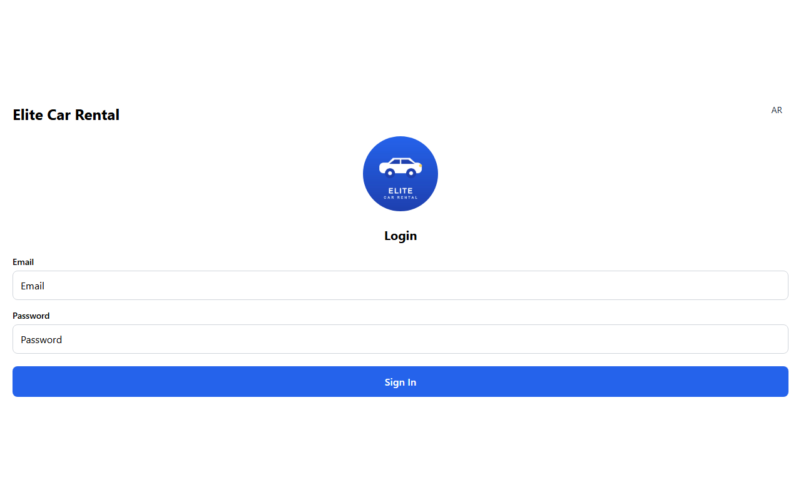
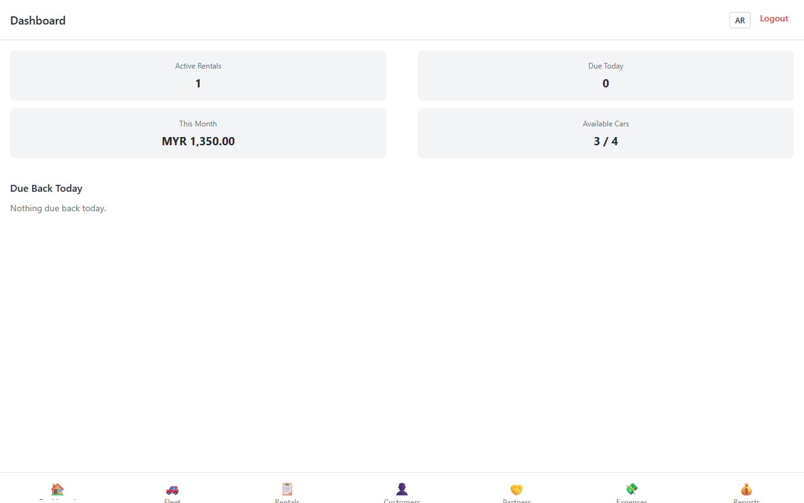
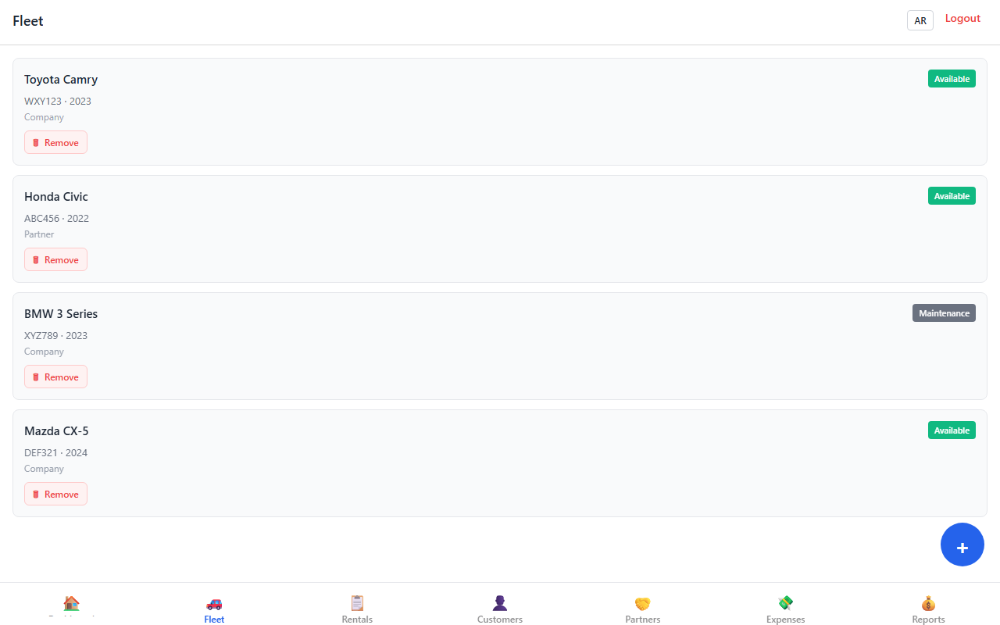
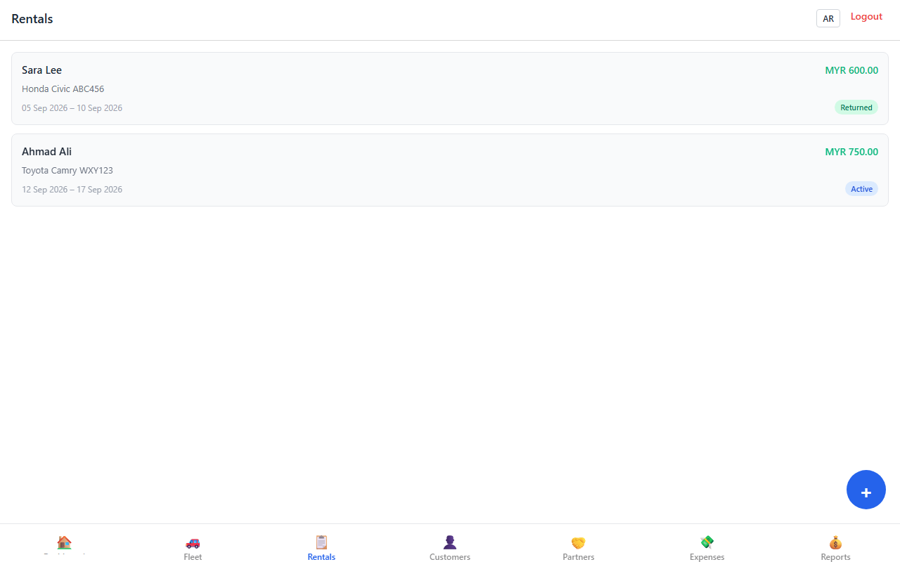
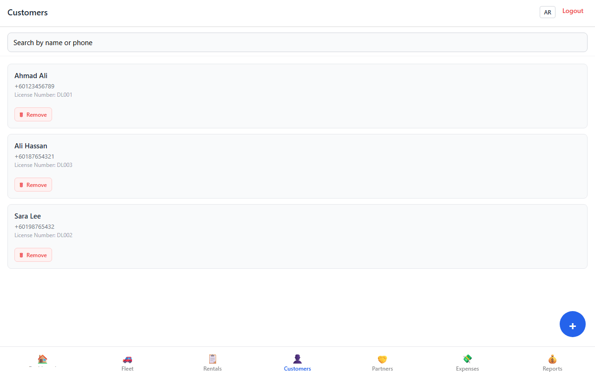
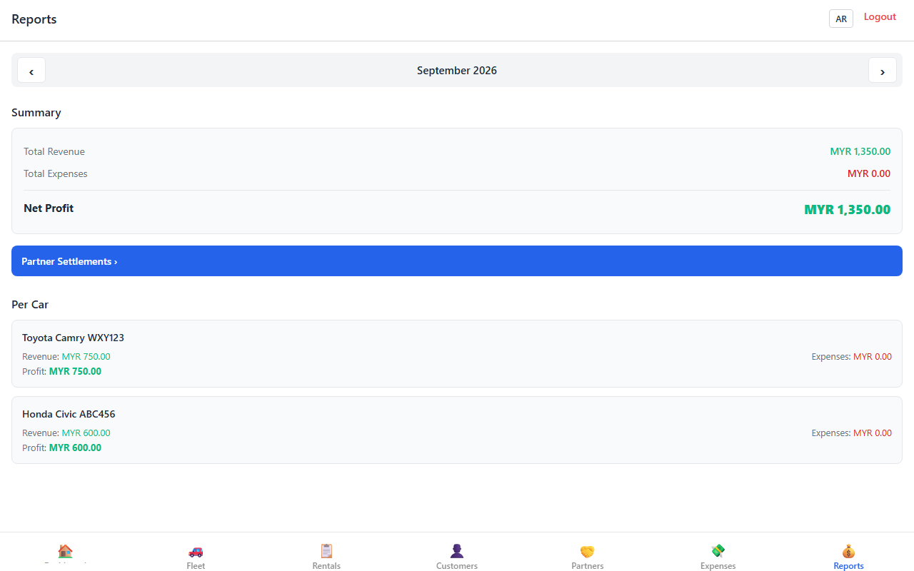
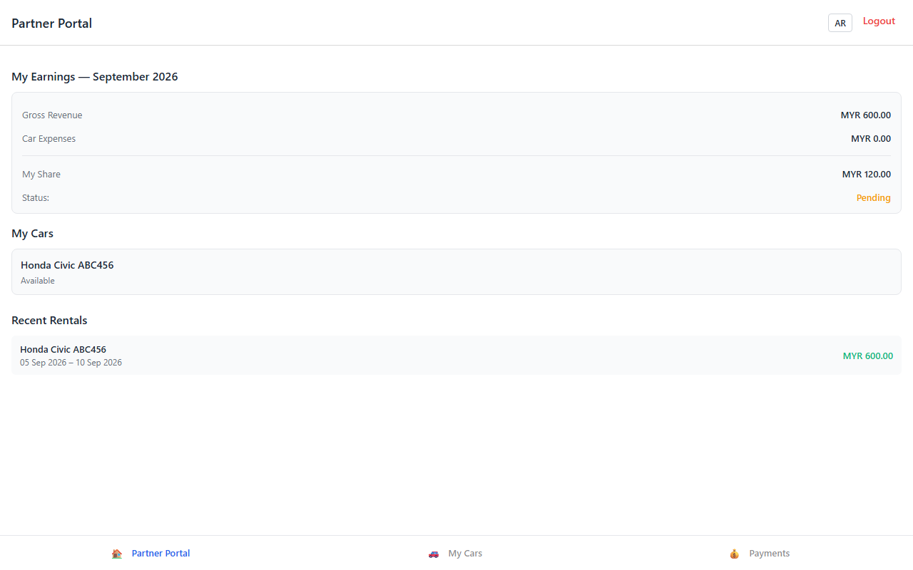

# Elite Car Rental

A cross-platform fleet and rental management app for small car rental operators — built with React Native, Expo Router, and Supabase. Staff manage the fleet, customers, and rentals day to day; partners who co-own cars get their own read-only portal to track earnings and settlements, with no spreadsheet reconciliation required.

## Screenshots

| Login | Staff Dashboard | Fleet |
|---|---|---|
|  |  |  |

| Rentals | Customers | Monthly Reports |
|---|---|---|
|  |  |  |

| Partner Portal |
|---|
|  |

## Features

**Staff**
- Fleet management — track cars by make/model/plate/status (available, rented, maintenance, inactive), company- or partner-owned
- Rentals — create daily/weekly/monthly/yearly bookings, adjust or settle on return with automatic recalculation, deposit and penalty handling
- Customers — searchable customer records with license/ID tracking and full rental history
- Partners — commission-rate configuration per partner, with cars and revenue attributed automatically
- Expenses — per-car (maintenance, fuel, repairs) and general company expenses
- Reports — monthly revenue, expenses, and net profit, broken down per car, plus partner settlement summaries

**Partners**
- A dedicated portal scoped to their own cars only (enforced server-side, not just hidden in the UI)
- Live earnings, gross revenue vs. their share, and settlement status (pending/paid)
- Rental and payment history for their vehicles

**Platform**
- Bilingual UI (English/Arabic) with full RTL layout support
- Role-based routing — staff and partner accounts land on entirely different navigation trees after login
- Offline-friendly data layer via TanStack Query caching

## Tech Stack

| Layer | Technology |
|---|---|
| App framework | React Native 0.85, Expo (SDK 56), Expo Router (file-based, typed routes) |
| Language | TypeScript |
| Backend | Supabase (Postgres, Auth, Row-Level Security) |
| Data fetching / caching | TanStack Query |
| Client state | Zustand |
| Forms & validation | react-hook-form + zod |
| Styling | NativeWind (Tailwind for React Native) |
| i18n | i18next / react-i18next |

## Architecture

Routing is organized by **role**, not by feature, using Expo Router's route groups:

```
src/app/
├── (auth)/             Login — unauthenticated
├── (staff)/             Staff role: fleet, rentals, customers, partners, expenses, reports
│   ├── cars/
│   ├── customers/
│   ├── partners/
│   ├── rentals/
│   └── reports/
└── (partner)/            Partner role: dashboard, my-cars, payments
```

`src/app/_layout.tsx` and `src/app/index.tsx` redirect each session to the right group based on the signed-in user's `role` (read from the `profiles` table). Data access follows a thin **service layer** (`src/services/*.service.ts`) wrapping the Supabase client — components call hooks in `src/hooks/`, hooks call services, services talk to Supabase. Authorization isn't just route-level: Postgres Row-Level Security policies enforce that a partner's queries can only ever return their own cars, rentals, and payments, regardless of what the client sends.

## Getting Started

```bash
npm install
```

Set up a Supabase project (schema + RLS policies + triggers are in `supabase/migrations/`) — see [SUPABASE_SETUP.md](SUPABASE_SETUP.md) for the full walkthrough, or [START_HERE.md](START_HERE.md) for the condensed version. Then:

```bash
cp .env.example .env.local
# fill in EXPO_PUBLIC_SUPABASE_URL and EXPO_PUBLIC_SUPABASE_ANON_KEY

npm run web    # or: npm run ios / npm run android
```

## License

MIT — see [LICENSE](LICENSE).
